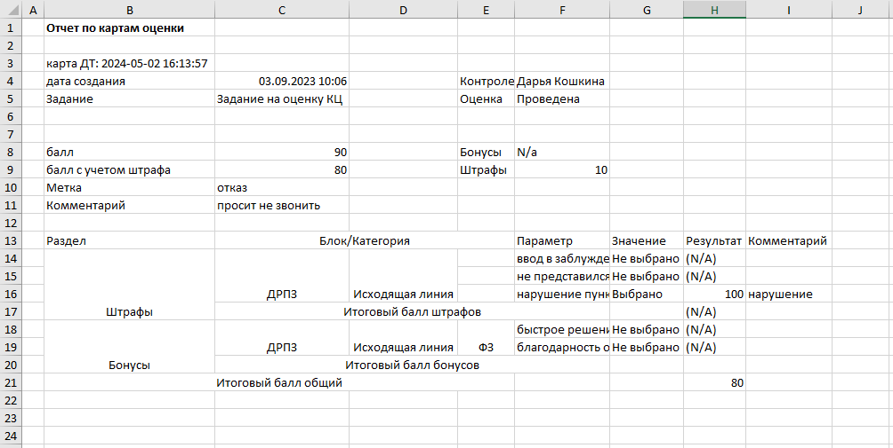

# Преобразование неструктурированной информации со всех листов из всех файлов, находящихся в папке, в табличный формат

## Описание

Jupyter Notebook ("rab.ipynb") преобразует несколько неструктурированных Excel-файлов с оценками сотрудников (звонки, штрафы, бонусы) в единый плоский DataFrame для дальнейшей работы.

Данные: Примеры оценок звонков в колл-центре, включая баллы, метки (отказ, автоответчик), статусы, нарушения, комментарии. Обработка ~30 строк из синтетических данных.

### Скриншот файла:

## Основные шаги
 
- Поиск и загрузка всех Excel-файлов из папки 'files'
- Выявление логики расположения данных в ячейках excel-файлов
- Распаковка и обработка данных (даты, сотрудники, параметры)  
- Объединение листов в один DataFrame

### Реализацию можно посмотреть с помощью следующих файлов:
  - rab.ipynb
  - rab.html

## Автор

Алтухов Николай  

2026